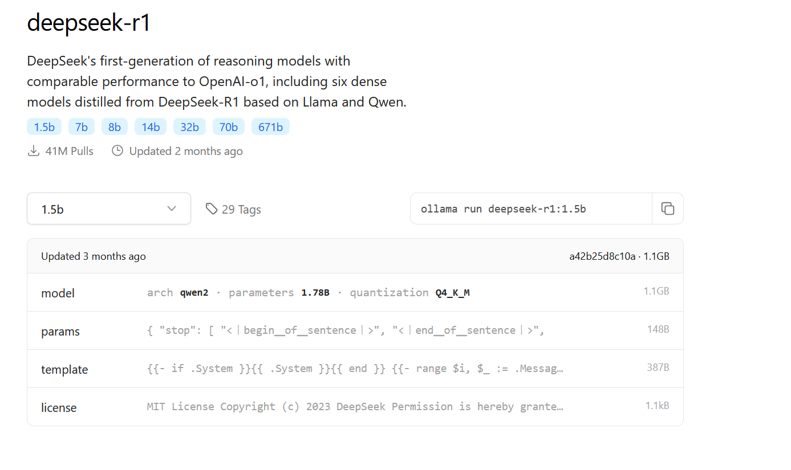

# Creating an AI Chatbot

This AI Chatbot is a computer program designed to simulate conversations with humans through text or voice. It utilizes artificial intelligence (AI) technology, primarily natural language processing (NLP) and machine learning (ML), to understand user queries and provide relevant answers using its backend, which employs AI-ML-LLM (such as ChatGPT, DeepSeek, Gemini).

# Demo Video

1. Video Demo of a Chatbot with a single LLM model using DeepSeek-R1:1.5B
[](./screenshoot/video-recording-chat-bot.mp4)

2. Video Demo of a Chatbot with three LLM models using DeepSeek-R1:1.5B, distilgpt2, distilgpt2-bandung (finetuned model)


# Table of Contents

1.  [Machine Learning - LLM](#1-machine-learning---llm)
2.  [AI Chat Architecture](#2-ai-chat-architecture)
3.  [Install Ollama Inference Platform](#3-install-ollama-inference-platform)
4.  [Import LLM Model](#4-import-llm-model)
5.  [Run Deepseek LLM Model](#5-run-deepseek-llm-model)
6.  [Test Prompt to Ollama via API](#6-test-prompt-to-ollama-via-api)
7.  [Prepare Dataset](#7-prepare-dataset)
8.  [Fine Tuning](#8-fine-tuning)
9.  [Install Python3](#9-install-python3)
10. [Download LLM Model](#10-download-llm-model)
11. [Fine Tuning Training](#11-fine-tuning-training)
12. [Run Finetuned Model on Python Inference Server](#12-run-finetuned-model-on-python-inference-server)
13. [Run GGUF Format Model on Ollama Inference Server](#13-run-gguf-format-model-on-ollama-inference-server)
14. [Demo Video](#-demo-video)
    1. [Video Demo of a Chatbot with a single LLM model using DeepSeek-R1:1.5B](#1-video-demo-chatbox-dengan-satu-model-llm-menggunakan-deepseek-r115b)
    2. [Video Demo of a Chatbot with three LLM models using DeepSeek-R1:1.5B, distilgpt2, distilgpt2-bandung (finetuned model)](#2-video-demo-chatbox-dengan-tiga-model-llm-menggunakan-deepseek-r115b-distilgpt2-distilgpt2-bandung-model-hasil-finetuning)

# 1. Machine Learning - LLM

Machine Learning (ML) is a branch of artificial intelligence (AI) that learns patterns and makes predictions based on data.

LLMs, or Large Language Models, are a type of ML model trained on vast amounts of text to understand and generate natural language.

Examples include GPT-3 and Llama2, Gemini, Copilot, Meta AI, which are used for tasks such as translation, writing, and conversation. LLMs work by learning the correlations and structure of language from the training data, allowing them to generate text that is coherent and contextually relevant.

LLMs, or Large Language Models, are a type of ML model trained on vast amounts of text to understand and generate natural language.

For examples of deploying LLMs on a private server, you can refer to:

https://github.com/dendie-sanjaya/ai-ml-llm-ollama

This source code will explain how to create a chatbot with an AI-ML-LLM backend.

# 2. AI Chat Architecture

The following is the architecture of the AI Chatbot:


# 3. Install Ollama Inference Platform

As an AI-MI-LLM server, you can use Ollama as the AI-MML inference platform. Ollama will act as the inference engine and provide an open API that can be accessed by the frontend.

For installation instructions, please refer here: -> https://github.com/dendie-sanjaya/ai-ml-llm-ollama

If the Ollama installation is successful and can be run, it will appear as follows:

```

ollama start

```


# 4. Import LLM Model

Ollama can import LLM models directly from the Ollama model repository. In this example, the model used is deepseek-r1.




# 5. Run Deepseek LLM Model

To activate the Deepseek Model, you can use the following command:

```

ollama run deepseek-r1:1.5b

```


# 6. Test Prompt to Ollama via API

To test sending an AI Prompt to Deepseek, you can do it via Postman. If the API is running, the result will be as follows:


# 7. Prepare Dataset

A dataset is clean or correct data. The more high-quality data you have, the better it will be for training the machine learning model, which will result in better answers. The following is an example of creating a dataset in CSV format for the purpose of building a chatbot:


# 8. Fine Tuning

Fine-tuning is the process of training a machine learning model by providing new knowledge, the results of which will be combined with its parent LLM model.

# 9. Install Python3

To perform fine-tuning, which is the process of training a machine learning model by providing new knowledge that will be combined with its parent model:

```

apt install python3.10-venv
python3 -m venv venv
source /venv/bin/activate
pip install datasets transformers peft accelerate
pip install peft

```


```

root@Dev01:/mnt/d/ai-chat-bot/tuning\# python3 --version
Python 3.10.12

```

# 10. Download LLM Model

Find a model with a name similar to the LLM model that will be the parent model for fine-tuning, and pay attention to the file extension (.gguf). For example, the Hugging Face Hub (https://huggingface.co/) is a primary source for LLM models. Often, the community creates and uploads versions of models in GGUF format. Examples include the DeepSeek-R1:1.5B and distilgpt2 models.


# 11. Fine Tuning

Perform fine-tuning by combining the parent LLM model. In this code example, distilgpt2.gguf is used, along with a CSV dataset file, as shown in this example using the dataset-bandung dataset.


The fine-tuning script file can be accessed at 

```

python3 distilgpt2-finetuning.py

```


The result of this fine-tuning process will be a new model in safetensors format (the LLM model format from Hugging Face).

# 12. Run Finetuned Model on Python Inference Server

An inference server is a server that acts as a bridge between the frontend to provide prompts or questions and display answers. Inference servers are usually equipped with a JSON API as a way to exchange data or information.

In this example, a Python-based inference server is created. First, install the dependencies:

```

pip install llama-cpp-python
pip install fastapi
pip install uvicorn

```

The Python Inference Server can read models in Hugging Face format:

```

uvicorn server-inference-read-hf:app --reload

```

The Python Inference Server can read models in GGUF format:

```

uvicorn server-inference-gguf:app --reload

```

If the inference server API is accessed via Postman, it will appear as below:


# 13. Run GGUF Format Model on Ollama Inference Server

The Ollama inference server can import many LLM models, and from the frontend, you can choose which LLM to use. The following is an example of importing a .gguf model:

```

ollama create distilgpt2-bandung -f /mnt/d/ai-chat-bot/tuning/Modelfile

```


The following is a list of LLM models that have been imported into Ollama:


```

Anda dapat menyalin seluruh teks di atas dengan sekali klik. Setiap *code snippet* tetap berada di dalam tag `<pre><code>` untuk format Markdown yang benar.
